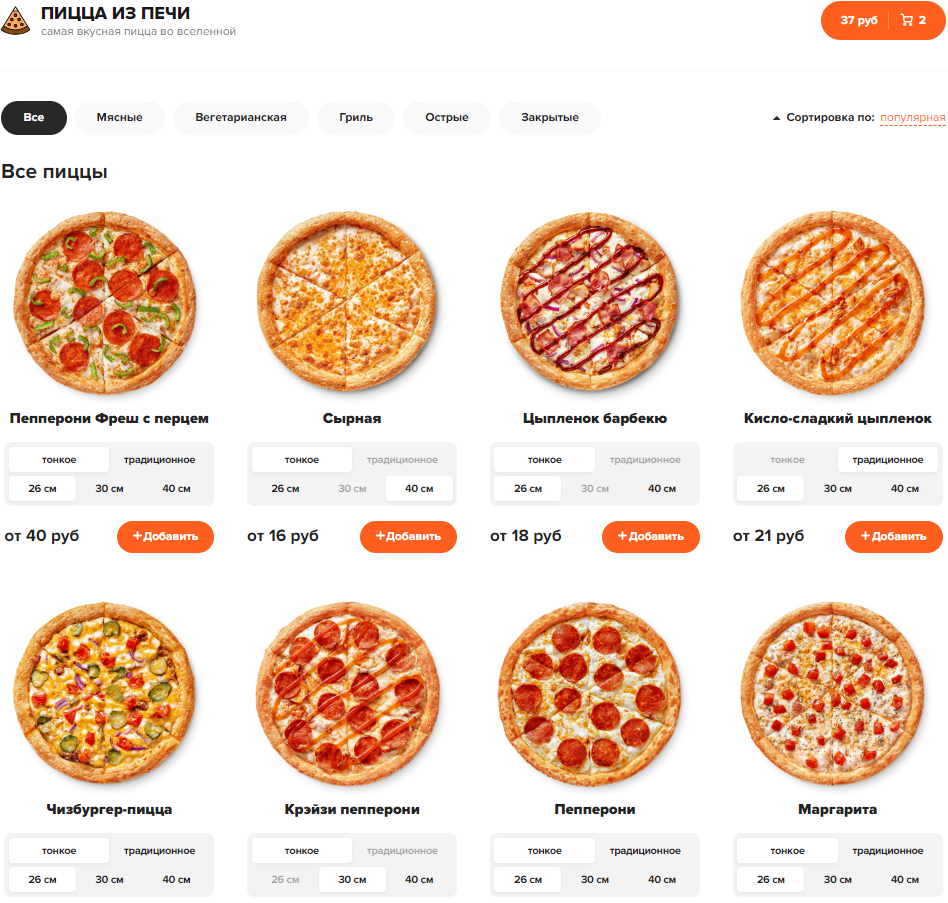

## Readme.me
 The repository contains the source code for an internet pizza shop, consisting of two pages: the homepage and the shopping cart.
 

## Features
The pizza shop web application includes the following features:

Sorting pizzas: Users can sort pizzas based on different criteria such as price, popularity, or name.
Adding to cart: Users can add pizzas to their shopping cart.
Pizza categories: Users can choose from various categories of pizzas.
Cart management: In the shopping cart, users can modify the quantity of pizzas or remove unwanted items.
## Technologies Used
The pizza shop web application is built using the following technologies:

ReactJS: A JavaScript library for building user interfaces.
<p>React Router: A routing library for React applications.</p>
<p>Redux: A predictable state container for JavaScript applications.</p>
<p>Redux Thunk: A middleware for Redux that allows handling asynchronous actions.</p>
<p>json-server: A simple JSON-based mock server for development and testing purposes.</p>
<p>Axios: A promise-based HTTP client for making API requests.</p>
<p>classnames: A utility for conditionally joining classNames together.</p>

## Installation
To run the pizza shop web application locally, follow these steps:

Clone the GitHub repository:


git clone https://github.com/evgenijkadyrov/pizza.git
```

Navigate to the project directory:


cd pizza
```

Install the dependencies:


npm install
```

Start the development app:


npm run dev
```

This will start the React development server and app.

Open your web browser and visit http://localhost:3000 to access the pizza shop web application.

## License
This project is licensed under the MIT License. See the LICENSE file for more information.

